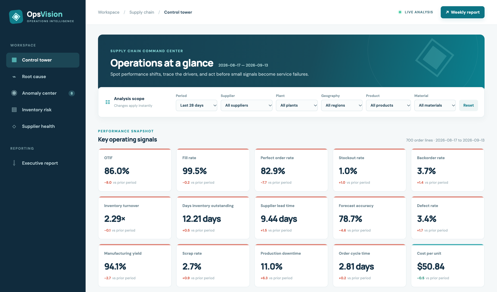
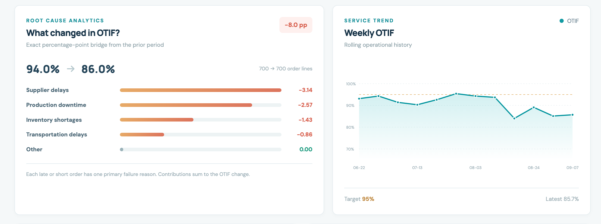
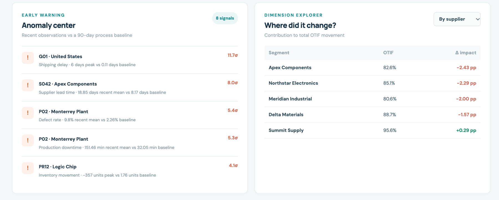
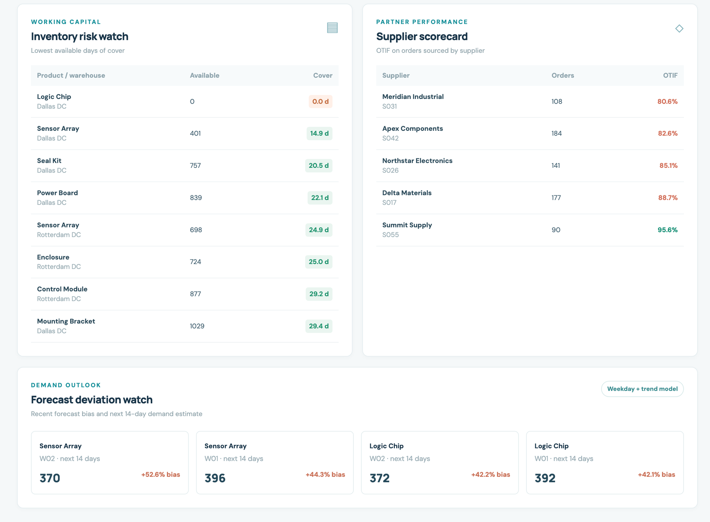
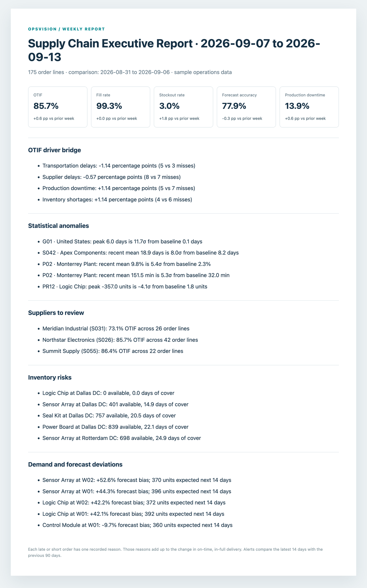

# OpsVision

### A supply chain analytics app for multi-site manufacturing.

OpsVision brings orders, purchasing, inventory, production, shipping, and quality records together. It shows what changed, where it changed, and which recorded issues contributed—then turns those findings into a weekly report.

**Python 3.9+** · **SQLite** · **No runtime dependencies** · **Sample data included**

[Purpose](#purpose-and-goals) · [Get started](#get-started) · [Explore the app](#explore-the-app) · [Use your own data](#use-your-own-data) · [Project guide](#project-guide)

  

> **About the data:** The screenshots and sample database show a made-up operation. They include a deliberate delivery decline so you can explore every part of the app without connecting company data.

## Purpose and goals

Imagine a manufacturer that buys parts from several suppliers, runs multiple plants, stores finished goods in warehouses, and ships to customers in different markets. A late order can start with a slow supplier, a stopped production line, missing stock, or transport trouble. Those events often sit in different files or systems, making it hard to see the full picture.

**OpsVision's goal is to make those records useful together.** It gives operations managers, buyers, plant teams, and inventory planners a shared view of service and cost, a way to investigate a change, and a repeatable report for the following week.

| Question a team needs to answer | What OpsVision provides |
| --- | --- |
| Are customers receiving complete orders on time? | Delivery, fill, backorder, cycle-time, and perfect-order measures, with a weekly trend. |
| Why did delivery performance move? | A breakdown of late or short orders by their recorded main reason, plus supplier, plant, geography, product, and material views. |
| What needs attention today? | Alerts for unusual lead times, defects, stock movements, downtime, and shipping delays; stock cover and supplier lists. |
| What should we prepare for next? | A 14-day demand estimate, forecast misses, and a weekly summary of the main changes and risks. |

The project is **an analysis and reporting tool**. It does not place purchase orders, change production schedules, or claim to prove that any single event caused a later outcome. People can use its findings to decide what to investigate and do next.

### Records in, answers out

OpsVision accepts ten connected areas of operations data: **orders, purchase orders, suppliers, inventory, manufacturing, shipments, returns, defects, warehouses, and products**. Plants, materials, dates, destinations, and forecasts provide the context needed to compare those records.

It produces an interactive dashboard with 15 measures, a delivery-change breakdown, statistical alerts, a two-week demand outlook, spreadsheet-ready exports, and a printable weekly report. [The data guide](docs/data.md) explains the required files; [the measures guide](docs/metrics.md) defines each number.

## Get started

Clone the repository, then run these commands from its root folder:

~~~bash
git clone https://github.com/RajivPraveen/OpsVision.git
cd OpsVision
python3 -m opsvision seed
python3 -m opsvision serve
~~~

Open **[http://127.0.0.1:8000](http://127.0.0.1:8000)**. The server can also create the sample database on its first run, so the seed command is optional. Python 3.9 or newer is all you need for local use.

| To do this | Run this |
| --- | --- |
| Open the dashboard | <code>python3 -m opsvision serve</code> |
| Rebuild the sample data | <code>python3 -m opsvision seed</code> |
| Create the weekly report | <code>python3 -m opsvision report</code> |
| Export spreadsheet files | <code>python3 -m opsvision export</code> |
| Run the checks | <code>python3 -m unittest discover -s tests -v</code> |

The report is written to reports/; spreadsheet-friendly CSV files go to exports/. These folders are created when needed.

## Explore the app

### 1. Start with the full picture

The dashboard shows **15 measures** for delivery, inventory, buying, manufacturing, quality, and cost. The default view compares the latest 28 days with the 28 days before them. Change the period or filter by supplier, plant, geography, product, or material.

The sample has **4,900 order lines** across 196 days. Its latest month records **86% on-time, in-full delivery**, down from **94%** in the prior month.

### 2. See why delivery changed

The delivery chart adds up the recorded reason for every late or short order. In the sample, supplier delays account for about **3.14 points** of the eight-point drop; production downtime, stock shortages, and transport delays explain the rest. The chart and the weekly trend sit side by side.

Each 28-day period has **700 order lines**. The prior period had **42** late or short lines; the current one has **98**. That is why on-time, in-full delivery moves from 94% to 86%:

| Recorded main reason | Prior period | Current period | Effect on delivery rate |
| --- | ---: | ---: | ---: |
| Supplier delays | 10 | 32 | −3.14 points |
| Production downtime | 9 | 27 | −2.57 points |
| Inventory shortages | 7 | 17 | −1.43 points |
| Transportation delays | 7 | 13 | −0.86 points |
| Other | 9 | 9 | 0.00 points |

The displayed values are rounded; the underlying reason shares add up to the full eight-point change. The breakdown reports what the order records say and gives the team a starting place for investigation.

  

Choose a supplier, plant, geography, product, or material to see where the change happened. Click a row to filter the whole page.

### 3. Catch unusual changes

The alert list checks the latest 14 days against the 90 days before them. It watches supplier lead times, defect rates, stock movements, plant downtime, and shipping delays. An alert includes the current reading, the usual reading, and how far apart they are.

  

### 4. Plan stock and supplier follow-up

The stock list shows which product and warehouse combinations have the fewest days of cover. The supplier list shows delivery performance by partner. The demand cards estimate the next 14 days and show where recent forecasts ran high or low.

  

### 5. Share the weekly report

Select **Weekly report** in the dashboard to open a printable summary. It covers the main measure changes, delivery reasons, unusual readings, suppliers to review, stock risks, and forecast misses. You can also create the report with the report command.

  

The [weekly GitHub Actions workflow](.github/workflows/weekly-report.yml) creates a **sample-data report** every Monday and keeps it as a downloadable workflow artifact. You can also run it manually from GitHub's Actions page. It does not send email or publish a live company report.

## How the pieces fit together

~~~mermaid
flowchart LR
  A[Orders and shipments] --> D[(SQLite database)]
  B[Suppliers and inventory] --> D
  C[Production and quality] --> D
  D --> E[Python calculations]
  E --> F[Browser dashboard]
  E --> G[Weekly report]
  D --> H[CSV export]
~~~

The database keeps separate records for orders, shipments, purchase orders, stock snapshots, production runs, defects, returns, and forecasts. Python calculates the measures and serves them to a lightweight browser page. The same calculations feed the weekly report, so the numbers agree across both views.

**Delivery reasons are recorded on orders.** The breakdown explains those recorded reasons; it does not prove that changing one supplier or machine would have prevented every late order. [How the measures work](docs/metrics.md) explains the calculations and their limits.

## Use your own data

The export command creates one CSV per database table with the expected column names. Map your order, warehouse, purchasing, production, and quality extracts to those columns, then load them into a **new** database:

~~~bash
python3 -m opsvision export
python3 -m opsvision ingest --input-dir /path/to/your/csvs --db data/operations.db
python3 -m opsvision serve --db data/operations.db
python3 -m opsvision report --db data/operations.db
~~~

The loader checks headers and table relationships. It removes an incomplete new database if a load fails. See [the data guide](docs/data.md) for the table list and preparation steps. CSV exports also open in Excel, Power BI, or Tableau.

## Other ways to run it

Install the command-line app locally:

~~~bash
python3 -m pip install .
opsvision serve
~~~

Or build and run the Docker image:

~~~bash
docker build -t opsvision .
docker run --rm -p 8000:8000 opsvision
~~~

The Docker command starts with sample data. For data you want to keep between runs, mount a folder at /app/data.

## Project guide

~~~text
OpsVision/
├── opsvision/                 Python app, calculations, database layout, and dashboard files
│   ├── analytics.py           Measures, delivery breakdown, alerts, and forecast
│   ├── ingest.py              CSV loader
│   ├── report.py              Weekly HTML and Markdown report
│   ├── schema.sql             Database tables
│   ├── seed.py                Repeatable sample data
│   ├── server.py              Local web server and JSON API
│   └── web/                   Dashboard HTML, CSS, and JavaScript
├── docs/                      Screenshots and plain-language guides
├── sql/                       Standalone example queries
├── tests/                     Checks for the calculations and data load
├── .github/workflows/         Automated checks and weekly sample report
├── Dockerfile                 Container setup
└── README.md
~~~

| Guide | What it covers |
| --- | --- |
| [Data guide](docs/data.md) | Tables, CSV files, and loading your own data |
| [Measures](docs/metrics.md) | Definitions, delivery breakdown, alerts, and forecast |
| [Architecture](docs/architecture.md) | How the app is organized and where each number comes from |
| [API guide](docs/api.md) | Dashboard data and report endpoints |
| [Development](docs/development.md) | Local changes, checks, and updating screenshots |

## Checks and scope

Run the test command above after a change. The checks confirm that the delivery breakdown sums to the displayed change, imported CSVs keep the same results, database links are valid, and the report is generated. The project uses only Python’s standard library at runtime.

OpsVision is a local demonstration, with sample data and a path to load your own extracts. Connecting directly to business systems, controlling access to company data, and sending scheduled reports to people are steps to configure for a real deployment.
