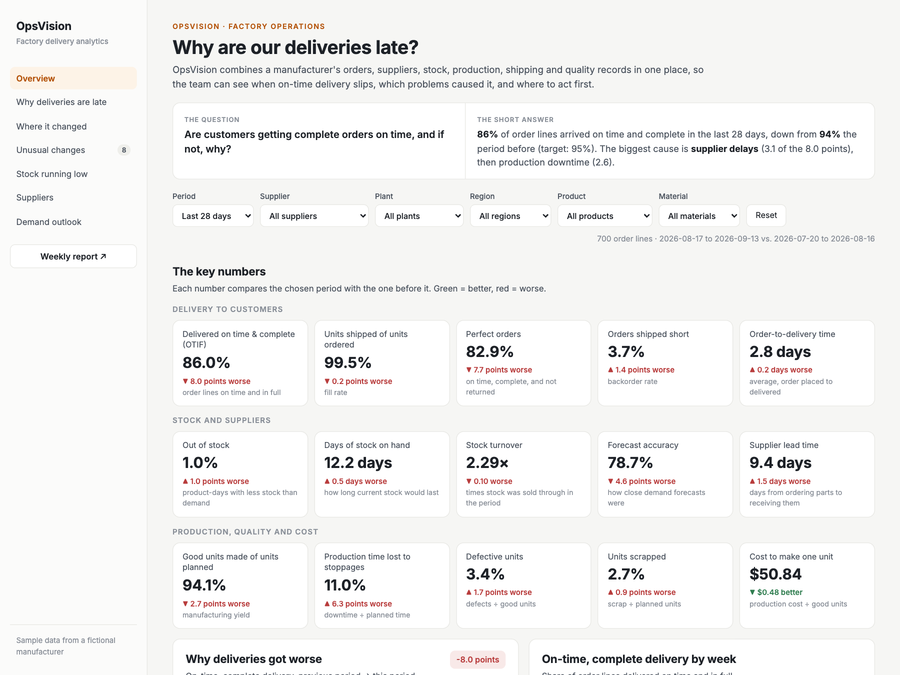
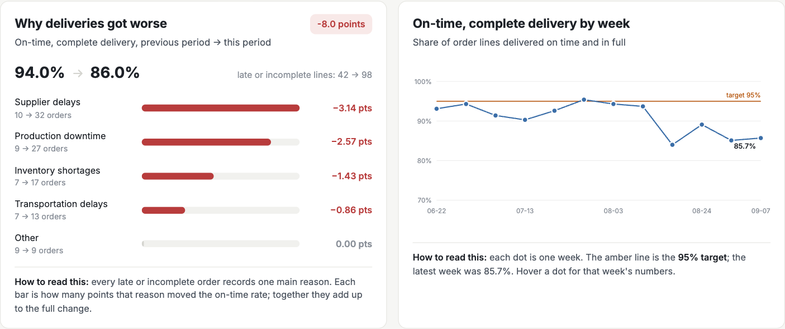
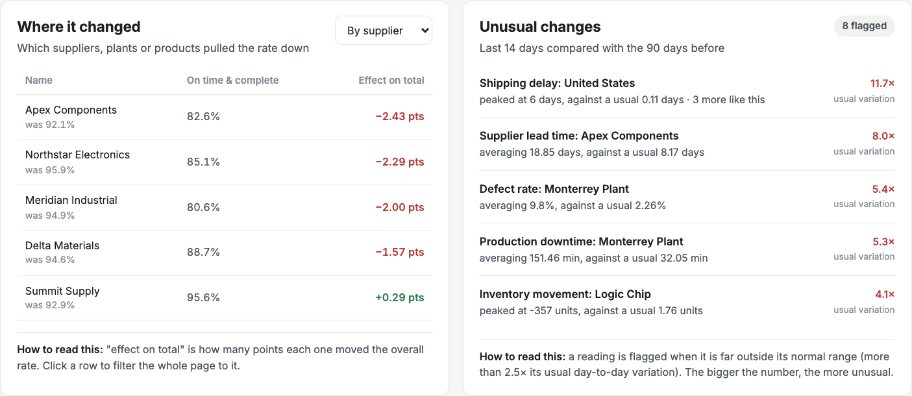
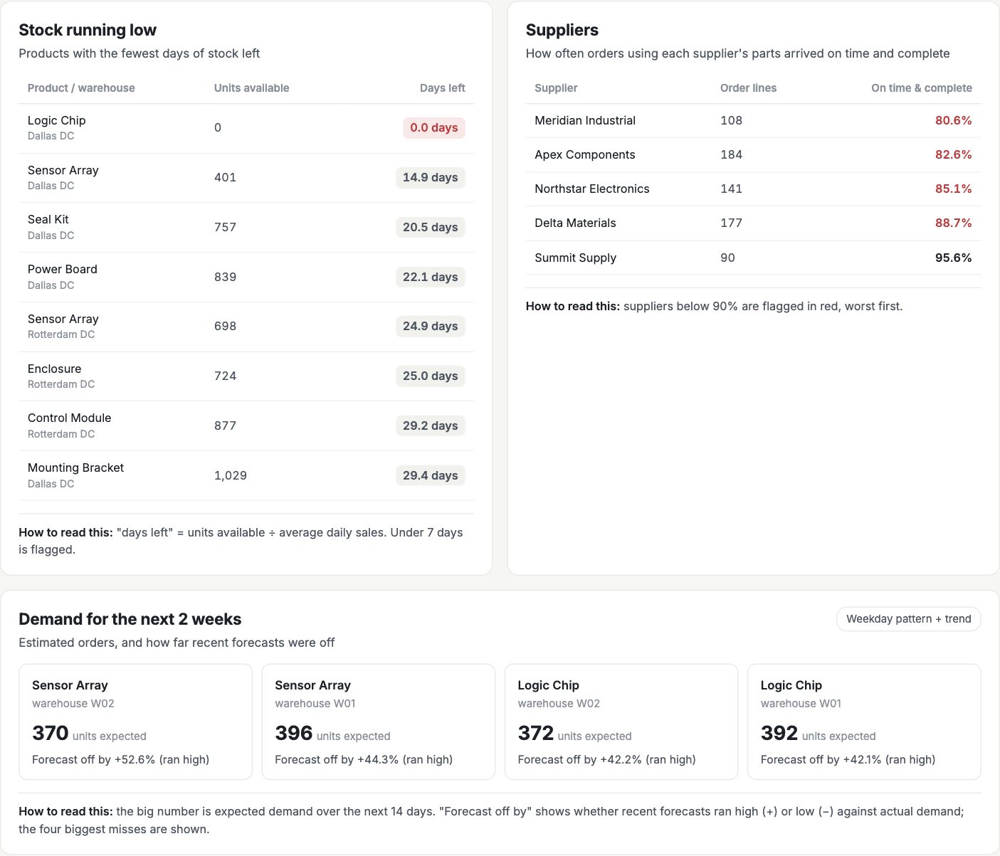
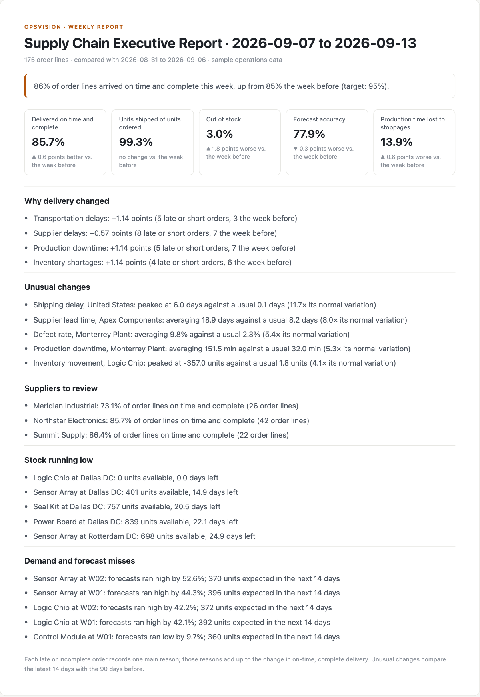

# OpsVision

### Why are a factory's deliveries late, and what should the team fix first?

**Python 3.9+** · **SQLite** · **No runtime dependencies** · **Sample data included**

[What is this?](#what-is-this) · [What it found](#what-it-found) · [The dashboard](#the-dashboard) · [KPIs](#kpis-on-the-dashboard) · [How it works](#how-it-works) · [Run it](#run-it) · [Use your own data](#use-your-own-data)

  

## What is this?

**OpsVision shows a manufacturer when on-time delivery slips, which problems caused it, and where to act first.**

Picture a company that buys parts from several suppliers, makes products in several plants, stores them in
warehouses and ships them to customers in different countries. A late order can start with a slow supplier, a
stopped production line, missing stock or a shipping problem, and those records usually live in different
systems. OpsVision puts them in one place and answers the questions an operations team asks every week:

| The question | Where to look |
|---|---|
| Are customers getting complete orders on time? | **The key numbers** and the weekly trend |
| Why did on-time delivery get worse? | **Why deliveries got worse**: the drop split by the recorded reason |
| Which supplier, plant, region or product is behind it? | **Where it changed** (click a row to filter the whole page) |
| What looks unusual right now? | **Unusual changes**: supplier lead times, defects, stock, downtime, shipping |
| What do we need to prepare for? | **Stock running low**, **Suppliers**, and **Demand for the next 2 weeks** |

It also produces a **one-page weekly report** for the people who won't open the dashboard.

> **About the data:** the sample database is a made-up manufacturer, with a deliberate drop in delivery built in so
> every part of the app has something to show. OpsVision analyses and reports; it doesn't place orders or change
> schedules, and it doesn't claim that one event *caused* a later outcome.

---

## What it found

In the sample data, **on-time, complete delivery fell from 94% to 86%** between the two most recent 28-day periods
(700 order lines each). Late or incomplete lines more than doubled, from 42 to 98. Every one records a main reason,
so the 8-point drop can be split exactly:

| Main reason recorded on the order | Before | Now | Effect on the on-time rate |
| --- | ---: | ---: | ---: |
| Supplier delays | 10 | 32 | **−3.14 points** |
| Production downtime | 9 | 27 | **−2.57 points** |
| Inventory shortages | 7 | 17 | **−1.43 points** |
| Transportation delays | 7 | 13 | **−0.86 points** |
| Other | 9 | 9 | 0.00 points |

- **Suppliers are the biggest single cause.** Apex Components and Northstar Electronics alone account for about
  4.7 of the 8 points, and Apex's lead time has more than doubled (from about 8 to 19 days).
- **One plant is struggling.** At the Monterrey plant, defects are running at 9.8% (usually 2.3%) and
  downtime averaging about 150 minutes (usually 32).
- **One product has run out.** Logic Chip has zero stock at the Dallas warehouse.

The breakdown reports what the order records say. It gives the team a starting point for investigation, not proof
that fixing one supplier would have prevented every late order.

---

## The dashboard

One page with the question and the short answer at the top, 15 key numbers, and six panels. Every panel has a
one-line "How to read this", and filters (period, supplier, plant, region, product, material) update everything at once.

### Why deliveries got worse, and the weekly trend

  

### Where it changed, and what looks unusual

  

### Stock, suppliers and demand

  

### The weekly report

Open **Weekly report** in the dashboard, or run the report command, for a printable one-page summary: the short
answer, key numbers, why delivery changed, unusual readings, suppliers to review, stock running low, and forecast
misses. A [GitHub Actions workflow](.github/workflows/weekly-report.yml) builds a sample report every Monday and
keeps it as a downloadable artifact (it doesn't email anyone).

  

---

## KPIs on the dashboard

All 15 measures, grouped as on the dashboard. Values are the last 28 days of the sample data, compared with the 28
days before. Exact formulas are in [the measures guide](docs/metrics.md).

**Delivery to customers**

| KPI | What it tells you | How it's calculated | Value |
|---|---|---|---|
| Delivered on time & complete (OTIF) | The headline service measure | Order lines delivered by the promised date and in full ÷ all order lines | **86.0%** (was 94.0%) |
| Units shipped of units ordered (fill rate) | How much of what customers asked for they got | Units delivered ÷ units ordered | **99.5%** (was 99.7%) |
| Perfect orders | Orders with nothing wrong at all | On-time, complete lines with no return ÷ all order lines | **82.9%** (was 90.6%) |
| Orders shipped short (backorder rate) | How often customers got part of an order | Lines delivered short ÷ all order lines | **3.7%** (was 2.3%) |
| Order-to-delivery time (cycle time) | How long customers wait | Average days from order placed to delivered | **2.8 days** (was 2.6) |

**Stock and suppliers**

| KPI | What it tells you | How it's calculated | Value |
|---|---|---|---|
| Out of stock (stockout rate) | How often a product ran short | Product-warehouse days with less stock than that day's demand ÷ all such days | **1.0%** (was 0.0%) |
| Days of stock on hand (DIO) | How long current stock would last | Days in the period ÷ stock turnover | **12.2 days** (was 11.7) |
| Stock turnover | How efficiently stock is sold through | Cost of goods delivered ÷ average daily stock value | **2.29×** (was 2.39×) |
| Forecast accuracy | How close demand forecasts were | 1 − (total forecast miss ÷ total actual demand) | **78.7%** (was 83.3%) |
| Supplier lead time | How long parts take to arrive | Average days from placing a purchase order to receiving it | **9.4 days** (was 7.9) |

**Production, quality and cost**

| KPI | What it tells you | How it's calculated | Value |
|---|---|---|---|
| Good units made of units planned (yield) | How much of the plan became sellable product | Good units ÷ planned units | **94.1%** (was 96.8%) |
| Production time lost to stoppages (downtime) | How often lines were stopped | Downtime minutes ÷ planned production minutes | **11.0%** (was 4.7%) |
| Defective units (defect rate) | Product quality | Defective units ÷ good units produced | **3.4%** (was 1.8%) |
| Units scrapped (scrap rate) | Waste | Scrap units ÷ planned units | **2.7%** (was 1.8%) |
| Cost to make one unit | Unit cost | Production cost ÷ good units | **$50.84** (was $51.32) |

**Analysis panels**

| Panel | What it shows | How it's calculated |
|---|---|---|
| Why deliveries got worse | Each reason's effect on the on-time rate | Each reason's share of all order lines now minus before; the effects add up to the total change |
| Where it changed | The same effect, by supplier, plant, region, product or material | Same method, split by the chosen dimension |
| Unusual changes | Readings far outside their normal range | Last 14 days vs. the 90 days before; flagged beyond 2.5× the usual variation (standard deviations) |
| Stock running low | Products about to run out | Units available ÷ average daily sales; under 7 days is flagged |
| Demand for the next 2 weeks | Expected orders, and recent forecast misses | Weekday pattern plus a capped 4-week trend, per product and warehouse |

---

## How it works

~~~mermaid
flowchart LR
  A[Orders and shipments] --> D[(SQLite database)]
  B[Suppliers and stock] --> D
  C[Production and quality] --> D
  D --> E[Python calculations]
  E --> F[Dashboard]
  E --> G[Weekly report]
  D --> H[CSV export]
  classDef step fill:#ffffff,stroke:#d4d4cf,color:#1d2127
  classDef out fill:#fdf3e7,stroke:#b45309,color:#1d2127
  class A,B,C,D,E,H step
  class F,G out
~~~

1. **Store.** A SQLite database holds ten connected areas of operations data: orders, purchase orders, suppliers,
   stock, production, shipments, returns, defects, warehouses and products.
2. **Calculate.** Python works out the 15 measures, the delivery breakdown, the unusual-change alerts and the
   two-week demand estimate.
3. **Show.** A lightweight browser page and the weekly report read the same calculations, so their numbers always
   agree. Everything can also be exported to CSV for Excel, Power BI or Tableau.

It uses only Python's standard library at runtime: no packages to install.

---

## Run it

Clone the repository, then from its folder:

~~~bash
git clone https://github.com/RajivPraveen/OpsVision.git
cd OpsVision
python3 -m opsvision serve
~~~

Open **[http://127.0.0.1:8000](http://127.0.0.1:8000)**. The first run creates the sample database automatically.

| To do this | Run this |
| --- | --- |
| Open the dashboard | <code>python3 -m opsvision serve</code> |
| Rebuild the sample data | <code>python3 -m opsvision seed</code> |
| Create the weekly report | <code>python3 -m opsvision report</code> |
| Export spreadsheet files | <code>python3 -m opsvision export</code> |
| Run the checks | <code>python3 -m unittest discover -s tests -v</code> |

The report is written to `reports/` and the CSV files to `exports/`.

<b>Other ways to run it</b>

 

Install the command-line app:

~~~bash
python3 -m pip install .
opsvision serve
~~~

Or run it in Docker (starts with sample data; mount a folder at `/app/data` to keep your own):

~~~bash
docker build -t opsvision .
docker run --rm -p 8000:8000 opsvision
~~~

## Use your own data

The export command writes one CSV per table with the expected column names. Map your order, warehouse, purchasing,
production and quality extracts to those columns, then load them into a **new** database:

~~~bash
python3 -m opsvision export
python3 -m opsvision ingest --input-dir /path/to/your/csvs --db data/operations.db
python3 -m opsvision serve --db data/operations.db
python3 -m opsvision report --db data/operations.db
~~~

The loader checks the column headers and that records link up correctly, and removes the new database if a load
fails partway. See [the data guide](docs/data.md) for the table list.

---

## Checks and scope

The automated tests confirm that:

- the delivery breakdown adds up exactly to the change in the on-time rate, both by reason and by supplier, plant
  or product;
- the sample data produces each expected type of unusual-change alert;
- the weekly report contains all its sections;
- every database link is valid;
- exporting to CSV and loading it back gives the same results.

[GitHub Actions](.github/workflows/ci.yml) runs them on every push across supported Python versions.

OpsVision is a local demonstration with sample data and a path to load your own extracts. Connecting to live
business systems, controlling who can see company data, and emailing reports to people are steps for a real
deployment.

<b>Project guide</b>

 

~~~text
OpsVision/
├── opsvision/                 Python app, calculations, database layout and dashboard files
│   ├── analytics.py           Measures, delivery breakdown, alerts and forecast
│   ├── ingest.py              CSV loader
│   ├── report.py              Weekly HTML and Markdown report
│   ├── schema.sql             Database tables
│   ├── seed.py                Repeatable sample data
│   ├── server.py              Local web server and JSON API
│   └── web/                   Dashboard HTML, CSS and JavaScript
├── docs/                      Screenshots and plain-language guides
├── sql/                       Standalone example queries
├── tests/                     Checks for the calculations and data load
├── .github/workflows/         Automated checks and weekly sample report
├── Dockerfile                 Container setup
└── README.md
~~~

| Guide | What it covers |
| --- | --- |
| [Data guide](docs/data.md) | Tables, CSV files, and loading your own data |
| [Measures](docs/metrics.md) | Definitions, delivery breakdown, alerts and forecast |
| [Architecture](docs/architecture.md) | How the app is organised and where each number comes from |
| [API guide](docs/api.md) | Dashboard data and report endpoints |
| [Development](docs/development.md) | Local changes, checks, and updating screenshots |

